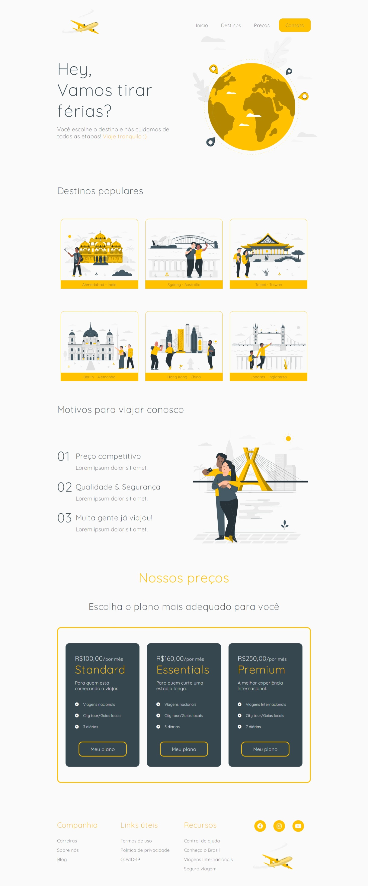

<h1 align="center">🛩️ Companhia de viagem</h1>

  <strong>Feito para forma de estudos, baseado em um site de companhia de viagens</strong>

Site realizado com dicas na DMW2 - Trilha Frontend da OverStack

  

### Site 💻

- [Companhia de viagem](https://cia-travel.netlify.app/)

## Linguagens: 🚀
- HTML
- CSS
- JavaScript
